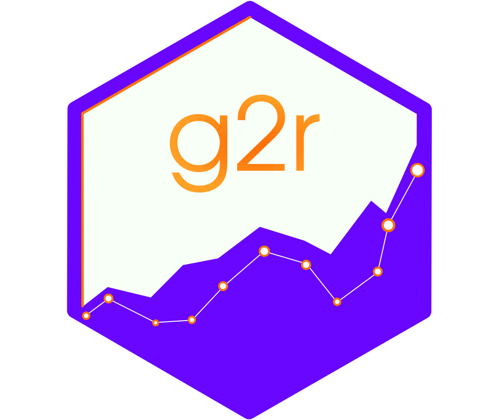
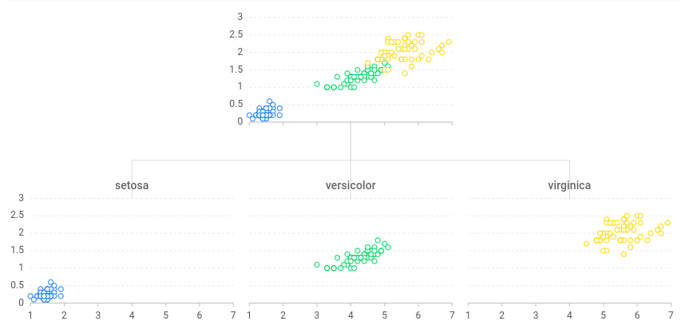

[](https://www.tidyverse.org/lifecycle/#experimental) [](https://travis-ci.org/JohnCoene/g2r)

# g2r



A [ggplot2](https://ggplot2.tidyverse.org/)-inspired grammar of graphics for interactive visualisations via [g2](https://antv.alipay.com/zh-cn/g2/3.x/).

See the [website](https://g2r.dev) for get started.

## Installation

``` r
# install.packages("remotes")
remotes::install_github("JohnCoene/g2r")
```

## Synthax

From ggplot2 to g2r.

1. `ggplot` -> `g2`
2. `aes` -> `asp` (aspects)
3. `geom_*` -> `fig_*` (figures)
4. `scale_*` -> `gauge_*`
5. `facet_*` -> `plane_*`
6. `theme_*` -> `motif_*`

## Example

``` r
library(g2r)

iris %>%
  g2(asp(Petal.Length, Petal.Width, color = Species)) %>% 
  fig_point() %>%
  plane_wrap(planes(Species), type = "tree")
```



Please note that the 'g2r' project is released with a [Contributor Code of Conduct](CODE_OF_CONDUCT.md). By contributing to this project, you agree to abide by its terms.

<a href="https://www.buymeacoffee.com/JohnCoene" target="_blank"></a>
